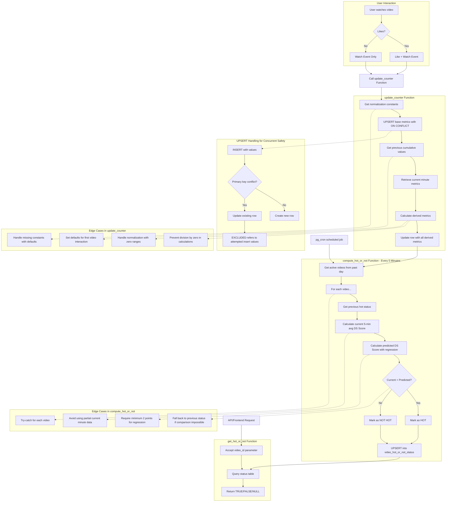

```mermaid
flowchart TD
    subgraph "User Interaction"
        A[User watches video] --> B{Likes?}
        B -->|Yes| C[Like + Watch Event]
        B -->|No| D[Watch Event Only]
    end

    C --> E[Call update_counter Function]
    D --> E

    subgraph "update_counter Function"
        E1[Get normalization constants]
        E2[UPSERT base metrics with ON CONFLICT]
        E3[Get previous cumulative values]
        E4[Retrieve current minute metrics]
        E5[Calculate derived metrics]
        E6[Update row with all derived metrics]

        E1 --> E2 --> E3 --> E4 --> E5 --> E6
    end

    E --> E1

    subgraph "UPSERT Handling for Concurrent Safety"
        U1[INSERT with values]
        U2{Primary key conflict?}
        U3[Create new row]
        U4[Update existing row]
        U5[EXCLUDED refers to attempted insert values]

        U1 --> U2
        U2 -->|No| U3
        U2 -->|Yes| U4
        U4 --> U5
    end

    E2 -.-> U1

    subgraph "Edge Cases in update_counter"
        EC1[Handle missing constants with defaults]
        EC2[Set defaults for first video interaction]
        EC3[Prevent division by zero in calculations]
        EC4[Handle normalization with zero ranges]

        E1 -.-> EC1
        E3 -.-> EC2
        E5 -.-> EC3
        E5 -.-> EC4
    end

    subgraph "compute_hot_or_not Function - Every 5 Minutes"
        G1[Get active videos from past day]
        G2[For each video...]
        G3[Get previous hot status]
        G4[Calculate current 5-min avg DS Score]
        G5[Calculate predicted DS Score with regression]
        G6{Current > Predicted?}
        G7[Mark as HOT]
        G8[Mark as NOT HOT]
        G9[UPSERT into video_hot_or_not_status]

        G1 --> G2 --> G3 --> G4 --> G5 --> G6
        G6 -->|Yes| G7 --> G9
        G6 -->|No| G8 --> G9
    end

    F[pg_cron scheduled job] --> G1

    subgraph "Edge Cases in compute_hot_or_not"
        GC1[Try-catch for each video]
        GC2[Fall back to previous status if comparison impossible]
        GC3[Require minimum 2 points for regression]
        GC4[Avoid using partial current minute data]

        G2 -.-> GC1
        G6 -.-> GC2
        G5 -.-> GC3
        G4 -.-> GC4
    end

    subgraph "get_hot_or_not Function"
        H1[Accept video_id parameter]
        H2[Query status table]
        H3[Return TRUE/FALSE/NULL]

        H1 --> H2 --> H3
    end

    H[API/Frontend Request] --> H1

    E6 --> G1
    G9 --> H2
```
